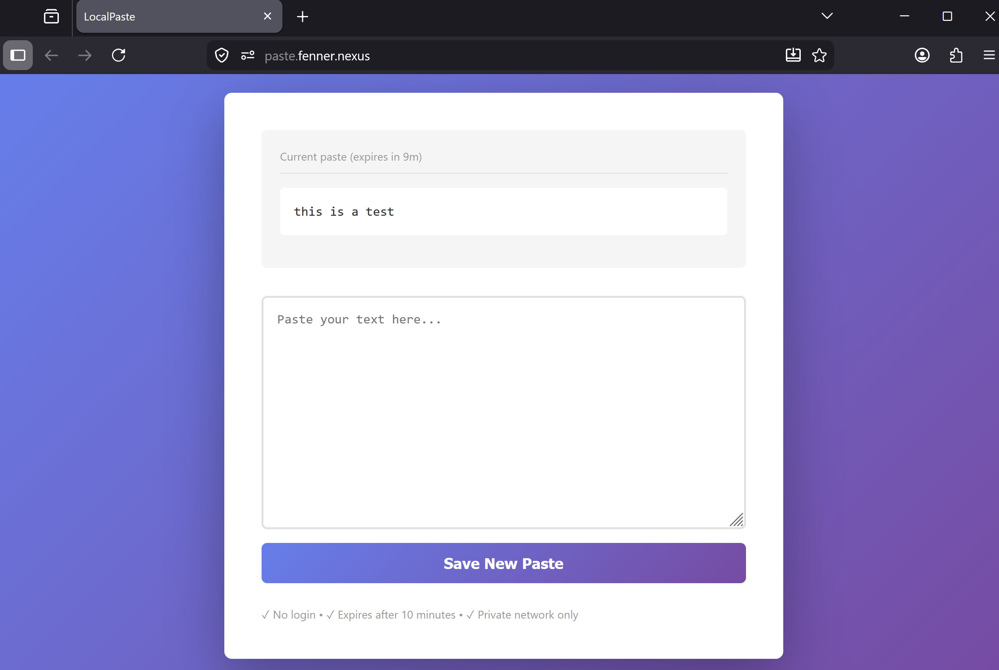

Tiny app that lets me send strings of text between devices **on my home network**.
Useful when I need to send a quick password or URL between devices on where I'm not logged into my password manager.

### Tech stack

- **Go 1.26** HTTP server using only the standard library
- **HTMX** handles form submission and partial page updates without a full page reload
- **Kubernetes** deployed as a single pod on my home cluster

### How it works

On `POST /`, the handler reads the `content` form field, acquires a mutex, and calls `paste.Write()` which serializes a `Paste` struct (content + expiry timestamp) to `paste.json` inside the pod. The response is a partial HTML fragment consumed by HTMX to update the page without a full reload.

On `GET /`, the handler reads and deserializes `paste.json`. If the paste has expired it is deleted and nothing is shown; otherwise the content and remaining time are rendered into the full page template.

A background goroutine (`StartCleanupRoutine`) ticks every minute and removes the file if the paste has expired.
